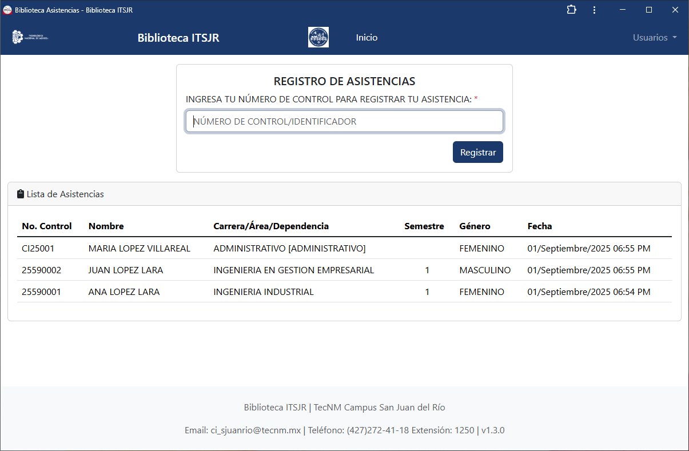
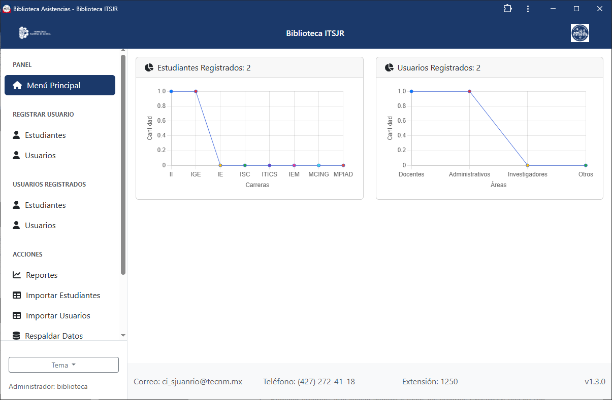
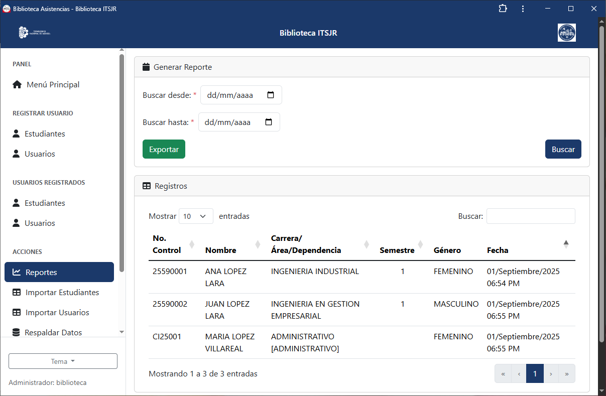

# Biblioteca Asistencias
Aplicación web implementada en la biblioteca del TecNM Campus San Juan del Río, permite registrar entradas de estudiantes, generar reportes y exportar datos a **Excel**.

## Tabla de contenido
- [Características principales](#características-principales)
- [Screenshots](#screenshots)
- [Tecnologías utilizadas](#tecnologías-utilizadas)
- [Requerimientos](#requerimientos)
- [Instalación](#instalación)
- [Licencia](#licencia)

## Características principales
- Registro de estudiantes y control de asistencias.
- Panel de administración con dashboard.
- Exportación de reportes a Excel (PhpSpreadsheet).
- Visualización de registros en tabla dinámica.
- Filtros de búsqueda y navegación desde menú lateral (administración).

## Screenshots

### Pantalla pública

> Pantalla pública

### Pantalla principal de administración

> Pantalla de administración

### Pantalla de reportes

> Pantalla para generar reportes y exportarlos a Excel

📂 Puede ver más capturas en la carpeta [/screenshots](screenshots/).

## Tecnologías utilizadas
**Frontend**
- [Bootstrap 5](https://getbootstrap.com/)
- [jQuery](https://jquery.com/)

**Backend**
- PHP 8.3
- [PhpSpreadsheet](https://github.com/PHPOffice/PhpSpreadsheet)

**Base de datos**
- MariaDB 10.5+

**Servidor**
- Apache 2.4

## Requerimientos
- PHP >= 8.3
- MariaDB >= 10.5
- Apache >= 2.4
- Composer

## Instalación

### 1. Descargar el proyecto
Puedes descargar la versión más reciente de Biblioteca Asistencias desde [GitHub Releases](https://github.com/mendozarojasdev/biblioteca-asistencias/releases/latest).

### 2. Instalar WampServer
- Descarga e instala [WampServer](https://sourceforge.net/projects/wampserver/files/latest/download) en Windows 10.
- Para que funcione correctamente, instala también las librerías necesarias:  
  👉 [VisualCppRedist AIO All](https://github.com/abbodi1406/vcredist/releases).

### 3. Configurar PHP en WampServer
Edita el archivo `php.ini` y ajusta las siguientes configuraciones:

```ini
date.timezone = America/Mexico_City
display_errors = Off
upload_max_filesize = 256M

# Habilita las siguientes extensiones
extension=mysqli
extension=gd
```

### 4. Configurar MariaDB en lugar de MySQL
En WampServer:
```ini
Right-click Wampmanager icon -> Tools -> Invert default DBMS MySQL to MariaDB
```

### 5. Crear la base de datos
- Abre phpMyAdmin desde localhost/phpmyadmin/
- Ingresa con usuario: **root** (sin contraseña por defecto).
- Copia y ejecuta el esquema que se encuentra en el [repositorio](database/biblioteca_asistencias.sql).

### 6. Desplegar el proyecto
Descomprime el archivo zip en:
```bash
C:\wamp\www\
```

### 7. Crear usuario principal
Ingresa a:
```bash
localhost/biblioteca-asistencias/admin/signup.php
```
En este aparado registra el primer usuario administrador.

### 8. Instalar la aplicación
- Una vez dentro, utiliza la opción “instalar” (aparece en la esquina derecha de la URL).
- Esto generará un acceso directo en tu escritorio para ingresar más fácilmente.

### 9. Instalar PhpSpreadsheet
Abre una terminal en la ruta:
```bash
C:/wamp/www/biblioteca-asistencias/componentes/phpspreadsheet
```
En esta ruta ejecuta el siguiente comando.
```bash
composer require phpoffice/phpspreadsheet
```
✅ Listo, el sistema debería estar funcionando en tu entorno local.

## Licencia
Biblioteca Asistencias está publicado bajo la licencia MIT. Consulta el archivo [MIT license](https://github.com/mendozarojasdev/biblioteca-asistencias/blob/master/LICENSE) para más información.
